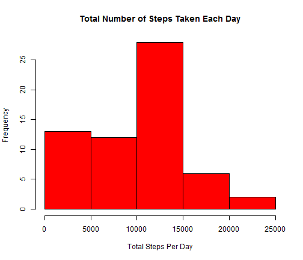
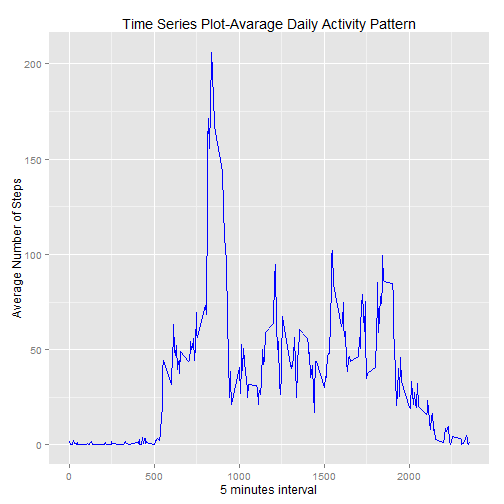
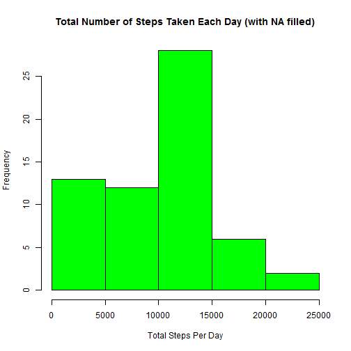
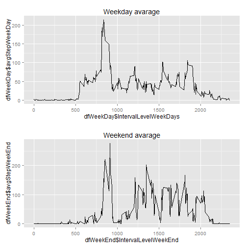

# Reproducible Research: Peer Assessment 1


## Loading and preprocessing the data

```r
require(stats)
data <- read.csv(unzip("activity.zip", "activity.csv"))  #read data from .zip file
data$Date <- as.Date(data$date, "%Y-%m-%d")  #convert date
```

## What is mean total number of steps taken per day?
* Make a histogram of the total number of steps taken each day

```r
totalStepsPerDay <- tapply(data$steps, data$Date, sum, na.rm = T)  #calculate total number of steps per day
hist(totalStepsPerDay, main = "Total Number of Steps Taken Each Day", col = "red", 
    xlab = "Total Steps Per Day")
```

 

* Calculate and report the **mean** and **median** total number of steps taken per day

```r
summary(totalStepsPerDay)
```

```
##    Min. 1st Qu.  Median    Mean 3rd Qu.    Max. 
##       0    6780   10400    9350   12800   21200
```

```r
meanStepPerDay <- tapply(data$steps, data$Date, mean, na.rm = T)  #calcuate mean
summary(meanStepPerDay)
```

```
##    Min. 1st Qu.  Median    Mean 3rd Qu.    Max.    NA's 
##    0.14   30.70   37.40   37.40   46.20   73.60       8
```


## What is the average daily activity pattern?
* Make a time series plot (i.e. type = "l") of the 5-minute interval (x-axis) and the average number of steps taken, averaged across all days (y-axis)

```r
data$IntervalFactor <- as.factor(data$interval)  #convert interval into factor type so as to apply level fcn
intervalLevel <- levels(data$IntervalFactor)
stepsMeanPerInterval <- tapply(data$steps, data$IntervalFactor, mean, na.rm = T)  #calculate mean
tempDF <- data.frame(stepsMeanPerInterval, as.numeric(intervalLevel))  #temporarily store as data fram 
library(ggplot2)
ggplot(tempDF, aes(as.numeric(intervalLevel), stepsMeanPerInterval)) + geom_line(colour = "blue") + 
    ggtitle("Time Series Plot-Avarage Daily Activity Pattern") + ylab("Average Number of Steps") + 
    xlab("5 minutes interval")  # use ggplot to plot
```

 

* Which 5-minute interval, on average across all the days in the dataset, contains the maximum number of steps?

```r
stepsMeanPerInterval[which.max(stepsMeanPerInterval)]
```

```
##   835 
## 206.2
```

The interval 835 has maximum avarage.

## Imputing missing values
* Calculate and report the total number of missing values in the dataset (i.e. the total number of rows with NAs)

```r
naSubset <- subset.data.frame(data, is.na(data$steps) == T | is.na(data$date) == 
    T | is.na(data$interval) == T, select = steps:IntervalFactor)  # extract rows with NA value
totalNumNA <- nrow(naSubset)  # count total number of missing values
print(totalNumNA)
```

```
## [1] 2304
```

  Total number of rows with NA is 2304, NA appears only in columns data$step .
* Devise a strategy for filling in all of the missing values in the dataset. The strategy does not need to be sophisticated. For example, you could use the mean/median for that day, or the mean for that 5-minute interval, etc.

```r
k <- which(is.na(data$steps))  # extract only the row with NA
```

* Create a new dataset that is equal to the original dataset but with the missing data filled in.

```r
dataWithoutNA <- data
dataWithoutNA$steps[k] <- meanStepPerDay[as.character(data$Date[k])]
```

* Make a histogram of the total number of steps taken each day and Calculate and report the mean and median total number of steps taken per day. Do these values differ from the estimates from the first part of the assignment? What is the impact of imputing missing data on the estimates of the total daily number of steps?

```r
totalStepsPerDayWithoutNA <- tapply(dataWithoutNA$steps, dataWithoutNA$Date, 
    sum, na.rm = T)  #calculate total number of steps per day
hist(totalStepsPerDayWithoutNA, main = "Total Number of Steps Taken Each Day (with NA filled)", 
    col = "green", xlab = "Total Steps Per Day")
```

 

```r
summary(totalStepsPerDayWithoutNA)
```

```
##    Min. 1st Qu.  Median    Mean 3rd Qu.    Max. 
##       0    6780   10400    9350   12800   21200
```

```r
meanStepPerDayWithoutNA <- tapply(dataWithoutNA$steps, dataWithoutNA$Date, mean, 
    na.rm = T)  #calcuate mean
summary(meanStepPerDayWithoutNA)
```

```
##    Min. 1st Qu.  Median    Mean 3rd Qu.    Max.    NA's 
##    0.14   30.70   37.40   37.40   46.20   73.60       8
```


totalStepsPerDayWithoutNA and totalStepPerDay are still the same.

```r
totalStepsPerDay
```

```
## 2012-10-01 2012-10-02 2012-10-03 2012-10-04 2012-10-05 2012-10-06 
##          0        126      11352      12116      13294      15420 
## 2012-10-07 2012-10-08 2012-10-09 2012-10-10 2012-10-11 2012-10-12 
##      11015          0      12811       9900      10304      17382 
## 2012-10-13 2012-10-14 2012-10-15 2012-10-16 2012-10-17 2012-10-18 
##      12426      15098      10139      15084      13452      10056 
## 2012-10-19 2012-10-20 2012-10-21 2012-10-22 2012-10-23 2012-10-24 
##      11829      10395       8821      13460       8918       8355 
## 2012-10-25 2012-10-26 2012-10-27 2012-10-28 2012-10-29 2012-10-30 
##       2492       6778      10119      11458       5018       9819 
## 2012-10-31 2012-11-01 2012-11-02 2012-11-03 2012-11-04 2012-11-05 
##      15414          0      10600      10571          0      10439 
## 2012-11-06 2012-11-07 2012-11-08 2012-11-09 2012-11-10 2012-11-11 
##       8334      12883       3219          0          0      12608 
## 2012-11-12 2012-11-13 2012-11-14 2012-11-15 2012-11-16 2012-11-17 
##      10765       7336          0         41       5441      14339 
## 2012-11-18 2012-11-19 2012-11-20 2012-11-21 2012-11-22 2012-11-23 
##      15110       8841       4472      12787      20427      21194 
## 2012-11-24 2012-11-25 2012-11-26 2012-11-27 2012-11-28 2012-11-29 
##      14478      11834      11162      13646      10183       7047 
## 2012-11-30 
##          0
```

```r
totalStepsPerDayWithoutNA
```

```
## 2012-10-01 2012-10-02 2012-10-03 2012-10-04 2012-10-05 2012-10-06 
##          0        126      11352      12116      13294      15420 
## 2012-10-07 2012-10-08 2012-10-09 2012-10-10 2012-10-11 2012-10-12 
##      11015          0      12811       9900      10304      17382 
## 2012-10-13 2012-10-14 2012-10-15 2012-10-16 2012-10-17 2012-10-18 
##      12426      15098      10139      15084      13452      10056 
## 2012-10-19 2012-10-20 2012-10-21 2012-10-22 2012-10-23 2012-10-24 
##      11829      10395       8821      13460       8918       8355 
## 2012-10-25 2012-10-26 2012-10-27 2012-10-28 2012-10-29 2012-10-30 
##       2492       6778      10119      11458       5018       9819 
## 2012-10-31 2012-11-01 2012-11-02 2012-11-03 2012-11-04 2012-11-05 
##      15414          0      10600      10571          0      10439 
## 2012-11-06 2012-11-07 2012-11-08 2012-11-09 2012-11-10 2012-11-11 
##       8334      12883       3219          0          0      12608 
## 2012-11-12 2012-11-13 2012-11-14 2012-11-15 2012-11-16 2012-11-17 
##      10765       7336          0         41       5441      14339 
## 2012-11-18 2012-11-19 2012-11-20 2012-11-21 2012-11-22 2012-11-23 
##      15110       8841       4472      12787      20427      21194 
## 2012-11-24 2012-11-25 2012-11-26 2012-11-27 2012-11-28 2012-11-29 
##      14478      11834      11162      13646      10183       7047 
## 2012-11-30 
##          0
```


## Are there differences in activity patterns between weekdays and weekends?
* Create a new factor variable in the dataset with two levels – “weekday” and “weekend” indicating whether a given date is a weekday or weekend day.

```r
data$Days <- weekdays(as.Date(as.character(data$date)))

k <- data$Days == "Saturday" | data$Days == "Sunday"

data$Days[k] = "Weekend"  # change to weekend
data$Days[!k] = "Weekday"  # then change to weekday

dataWeekEnd <- data[data$Days == "Weekend", ]  #copy each data
dataWeekDay <- data[data$Days == "Weekday", ]

IntervalLevelWeekDays <- as.numeric(levels(as.factor(dataWeekDay$interval)))  # level the interval of each data group
IntervalLevelWeekEnd <- as.numeric(levels(as.factor(dataWeekEnd$interval)))

avgStepWeekDay <- tapply(dataWeekDay$steps, dataWeekDay$interval, mean, na.rm = T)  # compute avarage steps of each data group
avgStepWeekEnd <- tapply(dataWeekEnd$steps, dataWeekEnd$interval, mean, na.rm = T)

dfWeekDay <- cbind.data.frame(avgStepWeekDay, IntervalLevelWeekDays)  # binding data into data frame for plotting
dfWeekEnd <- cbind.data.frame(avgStepWeekEnd, IntervalLevelWeekEnd)
```

* Make a panel plot containing a time series plot (i.e. type = "l") of the 5-minute interval (x-axis) and the average number of steps taken, averaged across all weekday days or weekend days (y-axis). 

```r
plot(dfWeekDay$IntervalLevelWeekDays, dfWeekDay$avgStepWeekDay, type = "l", 
    main = "Comparison of the Average Number of Steps\n between Weekdays and the Weekend", 
    col = "blue", xlab = "Steps Interval", ylab = "Average Number of Steps")  #plot weekday data
lines(dfWeekEnd$IntervalLevelWeekEnd, dfWeekEnd$avgStepWeekEnd, col = "red")  #plot weekend data
legend("topright", c("Weekday", "Weekend"), col = c("blue", "red"), lty = 1)  # annotate legend

library(grid)
p1 <- ggplot(dfWeekDay, aes(x = dfWeekDay$IntervalLevelWeekDays, y = dfWeekDay$avgStepWeekDay)) + 
    geom_line()
p2 <- ggplot(dfWeekEnd, aes(x = dfWeekEnd$IntervalLevelWeekEnd, y = dfWeekEnd$avgStepWeekEnd)) + 
    geom_line()

pushViewport(viewport(layout = grid.layout(2, 1)))
print(p1, vp = viewport(layout.pos.row = 1, layout.pos.col = 1))
print(p2, vp = viewport(layout.pos.row = 2, layout.pos.col = 1))
```

 


